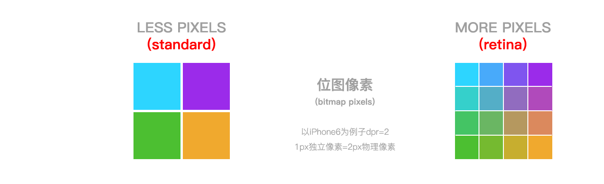
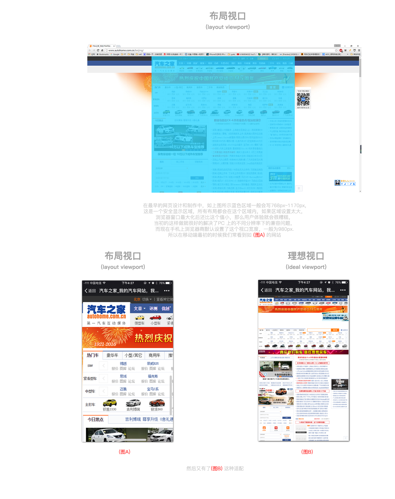

#移动端高清，多屏适配方案

####开发中需要解决的问题
1.开发移动端H5页面

2.图片适配

3.布局问题（视觉比例还原）

4.高清屏幕下1px border 问题
_ _ _
#一些概念

__视觉稿__

1.现在大多以iPhone6的```750x1334```为原始设计稿出设计效果图，即常说的2倍图效果，实际视觉效果是```375x667```，也就是视觉稿是设计稿缩小1倍。

2.对于iPhone下的retina屏幕（dpr>1）,为了达到高清效果，切图要给@x2 @x3，@x1用于dpr<2的

_ _ _
__物理像素(physical pixels)__

是显示设备（手机屏幕）上最小的物理显示单元，```他没有具体的大小```，只有相对的。比如某些电脑显示器，你仔细看能看见一格一格的亮点，那个就是这个显示器的最小物理显示单位。

__独立像素(density-independent pixels)__

设备独立像素（相对于当前物理像素的一个物理单元），可以认为是计算机坐标系统中的一个点，这个点代表一个可以由程序使用的虚拟像素(比如说CSS像素)，然后由相关系统转换为物理像素。(简单说这个独立像素单元的大小可以由程序控制，物理像素单元大小是设备固有的，这两者有一定的对应关系```设备像素比```)

__设备像素比(device pixel ratio)__

简称```dpr```，它定义了物理像素和设备独立像素的对应关系，值的获取：

``` 设备像素比=物理像素÷设备独立像素   具体是在某一方向上，X或Y```

js中通过 ```window.devicePixelRato```获取当前设备的dpr。

css中可以通过 ```-webkit-device-pixel-ratio```,```-webkit-min-device-pixel-ratio```和 ```-webkit-max-device-pixel-ratio```，进行媒体查询获得，然后根据不同dpr，做样式适配（只针对webkit内核的浏览器和webview）

    那我们拿到这个像素比到底有什么用？ 这个就是我们用来适配的一把钥匙。后面详细说明。
- - -

__物理像素 和 独立像素 具体差别__

拿```iPhone6```为例：

1.设备的宽高为```375x667```,这个是设备独立像素（css像素）

2.dpr为2，根据上面的公式，他的物理像素就应该是```750x1334```,正如上面的公式，在iPhone6下1单位css像素实际是4单位的物理像素（1px css像素=2px 物理像素）

具体可以用下面的图来解释


_ _ _

有了上图的解释，我们就引出了```位图像素```这个概念

__位图像素(bitmap pixels)__

一个位图像素是栅格图像（png,jpg,gif等以点阵的形式储存的图片），每个位图像素都包含了 位置 颜色 透明度等信息.
_ _ _
我们需要的是1位图像素对应1个物理像素，图片才能清晰，完整的展示。

这个在普通屏幕下是没有问题的，但在retina屏幕下就会出现位图像素点不够，导致图片模糊的状况。

具体差别用下图来解释



如上图：一张```2px 2px```的图，如果放在普通屏幕下也就是dpr=1（1独立像素=1物理像素）是没有影响的，
但在retina屏幕下就出现图片像素不够用被拉升分布在4x4个像素下，由于位图像素不可以进一步分像素了，所以只能取临色，
从而导致图片模糊。

所以对于高dpr的处理就是提供对应```dpr```图，也就是我们常说的 ```@x1``` ```@x2``` ```@x3```

    这里有些朋友可能会说，我图片直接用最大的不就可以了嘛，实际处理中其实也还是可以的，但是会有几个问题，
    1.移动端要尽量小！！！高dpr加载大图还说的过去，但是dpr很低的去加载大图就是浪费网络资源！
    2.大图缩小，图片会丢失一定锐度和色差，这个原因和上面的一样，你4css像素非要放在2物理像素里面，肯定挤啊，然后颜色就挤一起了，原本清晰的分界线，现在又不清晰了

这样就使得```位图像素点个数（独立像素）```与 ```物理像素点个数（物理像素）```形成 ```1 : 1```,自然显示环境就回到了最初普通屏幕下。

那么我们```问题2图片适配问题```就解决了,同时```问题3 1px border```也很好理解了，因此如果只做iPhone 我们可以直接写0.5px```安卓不支持0.5px,```，
更常用的是使用```scale```来解决，如下

```csss
//border-top
 &:before{
    content: '';
    position: absolute;
    left: 0;
    background: #d6d6d6;
    width: 100%;
    height: 1px;
    -webkit-transform: scaleY(0.5);
    transform: scaleY(0.5);
    -webkit-transform-origin: 0 0;
    transform-origin: 0 0;
  }
//border-bottom
  &:after{
    content: '';
    position: absolute;
    left: 0;
    background: #d6d6d6;
    width: 100%;
    height: 1px;
    -webkit-transform: scaleY(0.5);
    transform: scaleY(0.5);
    -webkit-transform-origin: 0 0;
    transform-origin: 0 0;
  }
```

_ _ _

那么接下来还有1个问题

```布局问题（视觉比例还原）```

这里我们就要引出```viewport```

这里有几个 ```viewport```

```布局视口(layout viewport)```

```视觉视口(visual viewport)```

```理想视口(ideal viewport)```

__布局视口（layout viewport）__

一个没有为移动端做优化的网页。这是我的手机查看汽车之家电脑板的样子，你也可以在Chrome中以移动开发模式看到。

```就是下图中蓝色区域，最先手机端是直接只显示这个区域的，然后通过左右上下滚动 外加缩放 查看```



__视觉视口(visual viewport)__

这个好理解，就是你手机屏幕可见范围！

__理想视口(ideal viewport)__

视觉视口=布局视口

```最后就形成了 图B ```

