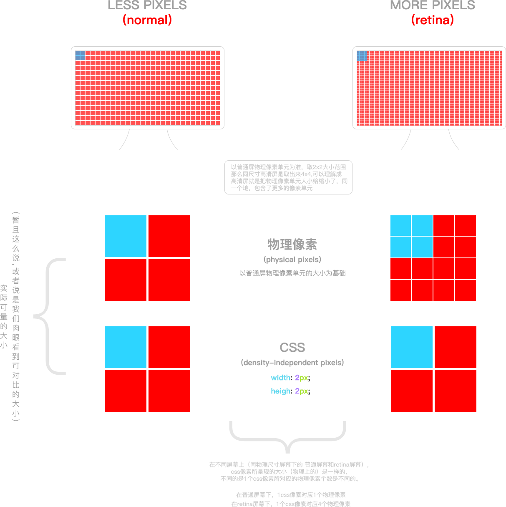

#移动端高清，多屏适配方案

####背景
1.开发移动端H5页面

2.图片适配

3.布局问题（视觉比例还原）

4.高清屏幕下1px border 问题
_ _ _
##一些概念

__视觉稿__

1.现在大多以iPhone6的```750x1334```为原始设计稿出设计效果图，即常说的2倍图效果，但是针对iPhone 高清屏实际看到的是视觉效果是```375x667```，也就是视觉稿是设计稿缩小1倍。

2.对于iPhone下的retina屏幕（dpr=2）,为了达到高清效果，切图要给@x2的，@x1用于dpr<2的

__问题：__

1.为什么```dpr=2```的手机，为什么画布大小x2就可以解决高清问题？

2.如何在具体的css编码中还原真实的宽高,```比如iPhone的750设计稿 高度为88px，但在实际的显示中却是 44px ```

_ _ _
__物理像素(physical pixels)__

是显示设备（手机屏幕）上最小的物理显示单元，```他没有具体的大小```，只有相对的。比如某些电脑显示器，你仔细看能看见一格一格的亮点，那个就是这个显示器的最小物理显示单位。

__独立像素(density-independent pixels)__

设备独立像素（相对于当前物理像素的一个物理单元），可以认为是计算机坐标系统中的一个点，这个点代表一个可以由程序使用的虚拟像素(比如说CSS像素)，然后由相关系统转换为物理像素。(简单说这个独立像素单元的大小可以由程序控制，物理像素单元大小是设备固有的，这两者有一定的对应关系```设备像素比```)

__设备像素比(device pixel ratio)__

简称```dpr```，它定义了物理像素和设备独立像素的对应关系，值的获取：

``` 设备像素比=物理像素÷设备独立像素   具体是在某一方向上，X或Y```

js中通过 ```window.devicePixelRato```获取当前设备的dpr。

css中可以通过 ```-webkit-device-pixel-ratio```,```-webkit-min-device-pixel-ratio```和 ```-webkit-max-device-pixel-ratio```，进行媒体查询获得，然后根据不同dpr，做样式适配（只针对webkit内核的浏览器和webview）

    那我们拿到这个像素比到底有什么用？ 这个就是我们用来适配的一把钥匙。后面详细说明。
- - -

__物理像素 和 独立像素 具体差别__

拿```iPhone6```为例：
1.设备的宽高为```375x667```,这个是设备独立像素（css像素）

2.dpr为2，根据上面的公式，他的物理像素就应该是```750x1334```。

具体可以用下面的图来解释



