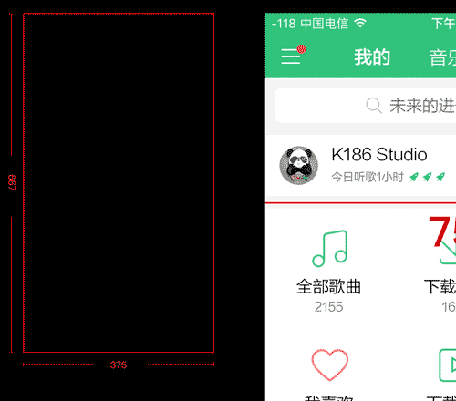

# 移动端高清，多屏适配方案

#### 开发中需要解决的问题
1.开发移动端H5页面

2.图片适配

3.布局问题（视觉比例还原）

4.高清屏幕下1px border 问题
_ _ _
# 一些概念

__视觉稿__

1.现在大多以iPhone6的```750x1334```为原始设计稿出设计效果图，即常说的2倍图效果，实际视觉效果是```375x667```，也就是视觉稿是设计稿缩小1倍.

2.对于iPhone下的retina屏幕（dpr>1）,为了达到高清效果，切图要给@x2 @x3，@x1用于dpr<2的

_ _ _
__物理像素(physical pixels)__

是显示设备（手机屏幕）上最小的物理显示单元，```他没有具体的大小```，只有相对的。比如某些电脑显示器，你仔细看能看见一格一格的亮点，那个就是这个显示器的最小物理显示单位.

__独立像素(density-independent pixels)__

设备独立像素（相对于当前物理像素的一个物理单元），可以认为是计算机坐标系统中的一个点，这个点代表一个可以由程序使用的虚拟像素(比如说CSS像素)，然后由相关系统转换为物理像素。(简单说这个独立像素单元的大小可以由程序控制，物理像素单元大小是设备固有的，这两者有一定的对应关系```设备像素比```)

__设备像素比(device pixel ratio)__

简称```dpr```，它定义了物理像素和设备独立像素的对应关系，值的获取：

``` 设备像素比=物理像素÷设备独立像素   具体是在某一方向上，X或Y```

js中通过 ```window.devicePixelRato```获取当前设备的dpr.

css中可以通过 ```-webkit-device-pixel-ratio```,```-webkit-min-device-pixel-ratio```和 ```-webkit-max-device-pixel-ratio```，进行媒体查询获得，然后根据不同dpr，做样式适配（只针对webkit内核的浏览器和webview）

    那我们拿到这个像素比到底有什么用？ 这个就是我们用来适配的一把钥匙。后面详细说明。
- - -

__物理像素 和 独立像素 具体差别__

拿```iPhone6```为例：

1.设备的宽高为```375x667```,这个是设备独立像素（css像素）

2.dpr为2，根据上面的公式，他的物理像素就应该是```750x1334```,正如上面的公式，在iPhone6下1单位css像素实际是4单位的物理像素（1px css像素=2px 物理像素）

具体可以用下面的图来解释


_ _ _

有了上图的解释，我们就引出了```位图像素```这个概念

__位图像素(bitmap pixels)__

一个位图像素是栅格图像（png,jpg,gif等以点阵的形式储存的图片），每个位图像素都包含了 位置 颜色 透明度等信息.
_ _ _
我们需要的是1位图像素对应1个物理像素，图片才能清晰，完整的展示.

这个在普通屏幕下是没有问题的，但在retina屏幕下就会出现位图像素点不够，导致图片模糊的状况。

具体差别用下图来解释


如上图：一张```2px 2px```的图，如果放在普通屏幕下也就是dpr=1（1独立像素=1物理像素）是没有影响的，
但在retina屏幕下就出现图片像素不够用被拉升分布在4x4个像素下，由于位图像素不可以进一步分像素了，所以只能取临色，
从而导致图片模糊.

所以对于高dpr的处理就是提供对应```dpr```图，也就是我们常说的 ```@x1``` ```@x2``` ```@x3```

    这里有些朋友可能会说，我图片直接用最大的不就可以了嘛，实际处理中其实也还是可以的，但是会有几个问题，
    1.移动端要尽量小！！！高dpr加载大图还说的过去，但是dpr很低的去加载大图就是浪费网络资源！
    2.大图缩小，图片会丢失一定锐度和色差，这个原因和上面的一样，你4css像素非要放在2物理像素里面，肯定挤啊，然后颜色就挤一起了，原本清晰的分界线，现在又不清晰了

这样就使得```位图像素点个数（独立像素）```与 ```物理像素点个数（物理像素）```形成 ```1 : 1```,自然显示环境就回到了最初普通屏幕下。

那么我们```问题2图片适配问题```就解决了,同时```问题3 1px border```也很好理解了，因此如果只做iPhone 我们可以直接写0.5px```安卓不支持0.5px,```，
更常用的是使用```scale```来解决，如下

```csss
//border-top
 &:before{
    content: '';
    position: absolute;
    left: 0;
    background: #d6d6d6;
    width: 100%;
    height: 1px;
    -webkit-transform: scaleY(0.5);
    transform: scaleY(0.5);
    -webkit-transform-origin: 0 0;
    transform-origin: 0 0;
  }
//border-bottom
  &:after{
    content: '';
    position: absolute;
    left: 0;
    background: #d6d6d6;
    width: 100%;
    height: 1px;
    -webkit-transform: scaleY(0.5);
    transform: scaleY(0.5);
    -webkit-transform-origin: 0 0;
    transform-origin: 0 0;
  }
```
_ _ _
那么接下来还有1个问题
这里我们就要引出 ```viewport```

这里有几个 ```viewport```

```布局视口(layout viewport)```

```视觉视口(visual viewport)```

```理想视口(ideal viewport)```

__布局视口（layout viewport）__

一个没有为移动端做优化的网页。这是我的手机查看汽车之家电脑板的样子，你也可以在Chrome中以移动开发模式看到.

```就是下图中蓝色区域，最先手机端是直接只显示这个区域的，然后通过左右上下滚动 外加缩放 查看```


__视觉视口(visual viewport)__

这个好理解，就是你手机屏幕可见范围！

__理想视口(ideal viewport)__

视觉视口=布局视口```图B ```

我们平时操作的 ```meta```中的 ```viewport```就是在调整布局视口（我是这么理解的）

比如下段代码

```html
<meta name="viewport" content="width=device-width,minimum-scale=1.0,maximum-scale=1.0,user-scalable=no">
```

具体的含义这里这不作解释了，具体可以google.

### 适配

上面讲了那么多概念，终于可以开始适配了.

上面我列问题就说了适配（视觉比例还原），为什么要加括号里面的呢？

我的理解是：

    好比一张16cm X 9cm的照片以前是放在16cm X 9cm 的相框但现在需要放入8cm X 4.5cm 相框，我们不可能把照片剪成这么大，
    只能缩小1倍，这样在看上去照片内容是没有变形的，但大小变了，而且视觉比例是正确的.

那么对于页面的适配我的想法就是，做一个版本，然后通过这种等比例缩放进行适配.那么我们缩放的是什么呢？就是```layout viewport```

大概代码就是
```html
<meta name="viewport" content="width=750,initial-scale=0.5,maximum-scale=0.5,minimum-scale=0.5,user-scalable=no">
```

__现有适配方案__

1.固定高度，宽度自适应

2.固定宽度，viewport缩放

3.rem宽高，viewport缩放
_ _ _

### 固定高度，宽度自适应

这也是目前使用最多的方法，垂直方向用定值，水平方向用百分比、定值、flex都行。腾讯、京东、百度、天猫、亚马逊的首页都是使用的这种方法。

随着屏幕宽度变化，页面也会跟着变化，效果就和PC页面的流体布局差不多，在哪个宽度需要调整的时候使用响应式布局调调就行（比如网易新闻），这样就实现了『适配』。

__原理__

这种方法使用了完美视口：
```html
<meta name="viewport" content="width=device-width,initial-scale=1">
```
这样设置之后，我们就可以不用管手机屏幕的尺寸进行开发了。

### 固定宽度，viewport缩放

设计图、页面宽度、viewport width使用一个宽度，浏览器帮我们完成缩放。单位使用px即可。

目前已知荔枝FM、网易新闻在使用这种方法。有兴趣的同学可以看看是怎么做的。

__原理__

这种方法根据屏幕宽度动态生成viewport：
```html
<meta name="viewport" content="width=640,initial-scale=0.5,maximum-scale=0.5,minimum-scale=0.5,user-scalable=no">
```
生成的viewport就是浏览器网页的```布局视口```使用640px```这个宽度是设计图的宽度，里面元素都是用PX单位```，然后把页面缩放成50%，这是绝对的等比例缩放。图片、文字等等所有元素都被缩放在手机屏幕中
```
开发者可以根据设计图上的标注进行html还原，不用考虑换算
```

这个方法跟我上面的假想很像



__rem宽高，viewport缩放__

淘宝现在的解决方案，并且有提供了库

[手淘解决方案](https://github.com/amfe/lib-flexible)

__原理__

1.动态生成 ```viewport```
2.根据屏幕宽度设置1rem的大小，即给
```<html>``` 设置```font-size```
3.根据设备像素比```window.devicePixelRatio```给```<html>```设置```data-dpr```


